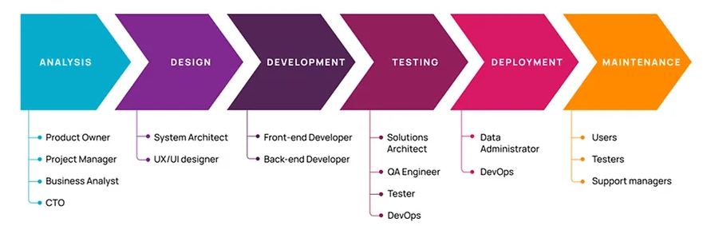

  <picture>
    <source media="(prefers-color-scheme: light)" srcset="./images/logo.svg">
    
  </picture>

# Overview

RoSe (**Ro**bust **Se**rvices)

# Software Development Life Cycle (SDLC)

todo

  <picture>
    <source media="(prefers-color-scheme: light)" srcset="./images/sdlc.png">
    
  </picture>

## Analysis

todo

## Design

### Hosting solutions

- Self-hosted with **Docker Compose**
- Self-hosted with **Kubernetes** + **Helm**
- Cloud (provisioned with **Terraform**)

### Communication

- Sync communication: **REST (JSON)**, **gRPC**
- Async communication: **RabbitMQ**

### External services

| Name                  | Use case                             |
| --------------------- | ------------------------------------ |
| Kong                  | API gateway                          |
| Keycloak              | Identity and Access Management (IAM) |
| Prometheus            | Metrics collection and storage       |
| Grafana               | Metrics visualization                |
| Elasticsearch         | Logs storage                         |
| Logstash              | Logs processing pipeline             |
| Kibana                | Logs visualization                   |
| Sentry                | Error tracking                       |
| AWS WAF               | Web Application Firewall (WAF)       |
| AWS CloudFront        | Content Delivery Network (CDN)       |
| AWS Route 53          | Domain Name System (DNS)             |
| AWS ECR               | Container registry                   |
| AWS ECS + AWS Fargate | Container orchestration              |
| AWS EFS               | File system for ECS volumes          |
| AWS RDS               | PostgreSQL database                  |

### Internal services

todo

## Development

todo

## Testing

todo

## Deployment

todo

## Maintenance

todo

# Roadmap

todo
